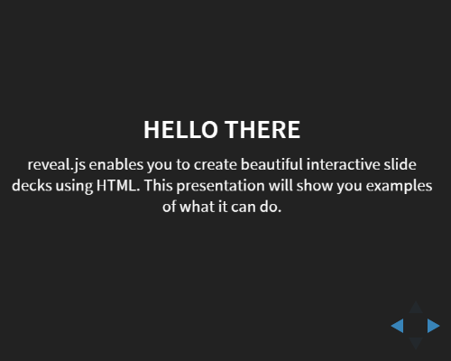

# reveal.js - Slide Show (S9) Template Pack

## Live Preview



See [`slides.html`](http://slideshow-templates.github.io/slideshow-reveal.js/slides.html).

For testing see
[`test.html`](http://slideshow-templates.github.io/slideshow-reveal.js/test.html) and
[`test.demo.html`](http://slideshow-templates.github.io/slideshow-reveal.js/test.demo.html).


## What's Slide Show (S9)?

A Ruby gem that lets you create slide shows and author slides in plain text
using a wiki-style markup language that's easy-to-write and easy-to-read.
More [Slide Show (S9) Project Site »](http://slideshow-s9.github.io)

## Intro

The [reveal.js](https://github.com/hakimel/reveal.js) package by Hakim El Hattab
bundled up into a Slide Show (S9) template pack.

Note, the package is configured to use the following headers in `slides.html`:

    author: Your Name Here
    title:  Your Slide Show Title Here
    theme:  black|white|league|sky|beige|simple|serif|blood|night|moon|solarized


## Try It Yourself - How To Use the Template Pack

If you want to try it yourself, install (fetch) the new template pack. Issue the command:

    $ slideshow install reveal.js

Or as an alternative clone the template pack using `git`. Issue the commands:

    $ cd ~/.slideshow/templates
    $ git clone https://github.com/slideshow-templates/slideshow-reveal.js.git

To check if the new template got installed, use the `list` command:

    $ slideshow list

Listing something like:

    Installed templates include:
       reveal.js (~/.slideshow/templates/reveal.js/reveal.js.txt)

Now you're ready to use it using the `-t/--template` switch. Example:

    $ slideshow build sample.md -t reveal.js

That's it.

## Example

```
title: reveal.js
subtitle: The HTML Presentation Framework
description: A framework for easily creating beautiful presentations using HTML
author: Hakim El Hattab
theme: black


## Hello There

reveal.js enables you to create beautiful interactive slide decks using HTML.
This presentation will show you examples of what it can do.


## Slides

Not a coder? Not a problem. There's a fully-featured visual editor for authoring these,
try it out at [slides.com](http://slides.com).


## Point of View

Press **ESC** to enter the slide overview.

Hold down alt and click on any element to zoom in on it using
[zoom.js](http://lab.hakim.se/zoom-js). Alt + click anywhere to zoom back out.


## Touch Optimized

Presentations look great on touch devices, like mobile phones and tablets.
Simply swipe through your slides.


## Marvelous List

- No order here
- Or here
- Or here
- Or here


## Fantastic Ordered List

1. One is smaller than...
2. Two is smaller than...
3. Three!


## Tabular Tables

Item     |  Value  | Quantity
---------|---------|---------
Apples   | $1      | 7
Lemonade | $2      | 18
Bread    | $3      | 2

...
```

(Source: [`sample.md`](sample.md))


## Questions? Comments?

Send them along to the [wwwmake forum/mailing list](http://groups.google.com/group/wwwmake).
Thanks!
